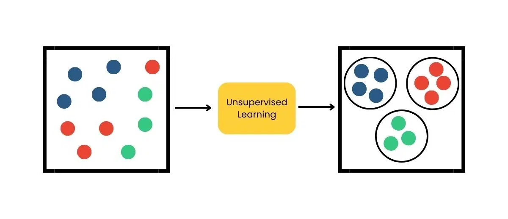
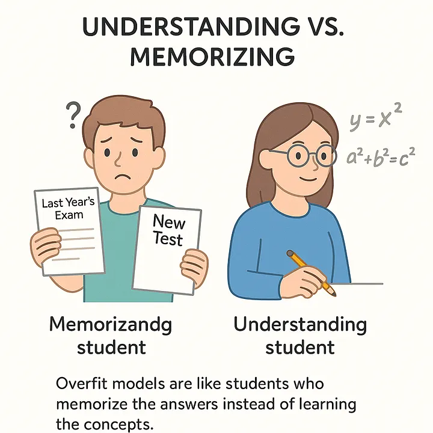
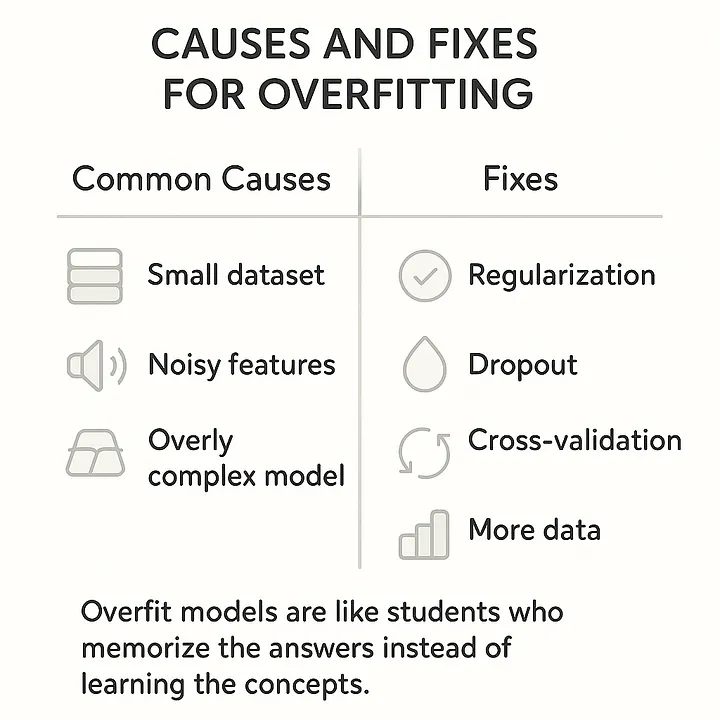

# Research

## 1 Data Science and Machine Learning

### Data Science (DS)

DS is a combination of mathematics, statistics, programming, and domain knowledge.

Data is everywhere, but it is often raw, incomplete, and messy. A data scientist cleans, organizes, and analyzes this data to uncover hidden patterns and transform it into meaningful, actionable insights.

eg. we ask students to complete a questionnaire, to understand the questioner we need a data scientist to interpret data and provide actionable results that help educators to make decisions and improve the learning experience.

### Machine Learning (ML)

`Hey machine, learn from this data.`

A machine learns patterns from training data to make accurate predictions on new data.

eg. You have sales data, days and number of sales each day.

- day1 -> 50
- day2 -> 55
- day3 -> 60
- day4 machine predicts 65 after learning from data patterns.

`Garbage in, garbage out.` If poor-quality data is used to train a model, the predictions will also be poor.

### Relationship between DS and ML

A machine needs data to learn and make predictions, so every data is raw and messy.
`Does machine needs raw/messy data? Usually, no.`, this is where data science comes in before training a machine learning model, the data must be cleaned and prepared.

## 2 Data Science lifecycle

- `Problem Definition`
- `Data Collection`
- `Data Cleaning`
- `Exploratory Data Analysis`
- `Feature Engineering`

#### Here is where Machine Learning Stage comes in. because the machine learning models needs well prepared quality data for modeling and evaluation.

- `Modeling`
- `Evaluation`

- `Communication & Deployment`

## 3 Compare Supervised Learning and Unsupervised Learning

| Supervised Learning                         | Unsupervised Learning                        |
| ------------------------------------------- | -------------------------------------------- |
| Learn from labeled data to make predictions | Find patterns or structure in unlabeled data |
| Labeled data with inputs and outputs        | Unlabeled data with only inputs              |
| Uses classification, regression             | Uses Clustering, dimensionality reduction    |
| Uses known correct answers during training  | No explicit correct answers available        |

### Supervised example

Suppose you have a dataset with weather temperature and a rainy indicator. Rainy is the label and the output.

The model learns from the dataset using the input and output columns.

| temperature | rainy |
| ----------- | ----- |
| 35          | 0     |
| 18          | 1     |
| 20          | 1     |
| 28          | 0     |

### Unsupervised example

Suppose you have a dataset of balls from different sports, such as football,tennis and etc.
The model groups the balls based on their features without using labels, and then uses those groups to predict where new balls belong.

## 4 What causes Overfitting?

Overfitting occurs when a machine learning model learns the training data "too well" and start memorizing rather than learning general patterns

### Cause

- small dataset
- too many features
- small training data
- un relevant train data
- Using a very flexible model without enough data.

To prevent model overfitting, address its underlying causes.

## 5 Explain how training data and test data are split, and why this process is necessary.

A train-test split is the process of dividing a dataset into two parts.
The training set is used to train the machine learning model to learn patterns.
The test set consists of unseen data that is not used during training and is used to evaluate how well the model has learned those patterns and how effectively it can generalize to new data.

`This process is necessary allows you to test your model in development phase.`

## 6 Adoption-Driven Data Science for Transportation Planning: Methodology, Case Study, and Lessons Learned

The study presents a collaborative data science methodology for solving transportation problems and demonstrates its effectiveness by applying it to estimate the transportation mode share in a city of 8 million people. The project successfully generated actionable insights and helped establish the first official use of mobile phone data for understanding transportation patterns in Chile.

### Data science lifecycle it covers.

- `Problem Definition`
- `Data Collection`
- `Data Cleaning`
- `Exploratory Data Analysis`
- `Communication`

# References

- [Data Science](https://www.ibm.com/think/topics/data-science)
- [Machine Learning](https://www.ibm.com/think/topics/machine-learning)
- [DS Lifecycle](https://public.dhe.ibm.com/software/data/sw-library/analytics/data-science-lifecycle/)
- [Adoption-Driven Data Science for Transportation Planning: Methodology, Case Study, and Lessons Learned](https://www.mdpi.com/2071-1050/12/15/6001)
- [Overfitting](https://pub.towardsai.net/what-is-overfitting-in-machine-learning-ebdf40bb21b1)
